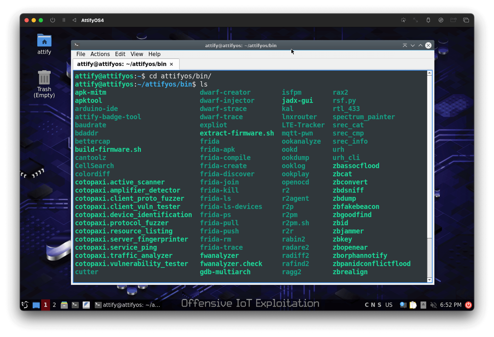

## AttifyOS 4.0

AttifyOS is a penetration testing distro for security professionals to assess the security of Internet of Things (IoT) devices. The latest version - AttifyOS 4.0 is based on Ubuntu 22.04 and contains pre-configured tools to help you with your next IoT pentest.

Login credentials 
```
attify
attify
```

## Downloads

You can download AttifyOS4 from GitHub [releases](https://github.com/AttifyOS/AttifyOS/releases).

## Installation

AttifyOS v4 is distributed both in the form of a OVA and an ISO. The OVA can be imported in VirtualBox and VMware Player/Workstation.

AttifyOS v4 can also be installed from the ISO. In such case ensure that the VM has atleast 2GiB of RAM and 60 GiB of disk space available.


## Tools pre-installed

AttifyOS comes with a set of tools included so that you don't have to waste time in installation and setup, and fixing potential issues that may come in the way. The current list of tools along with the version can be found on the GitHub repository [https://github.com/AttifyOS/package-index](https://github.com/AttifyOS/package-index) and also shown below. The tools are located in `/home/attify/attifyos-package-manager/` and also available on the system `PATH`.


| Name | Version | Comments | Repository URL | Build date |
| --- | --- | --- | --- | --- |
| Apktool | 2.6.1 |   | https://github.com/AttifyOS/apktool | Aug 8, 2022 |
| apk-mitm | 1.2.1 |   | https://github.com/AttifyOS/apk-mitm | Sep 6, 2022 |
| Arduino | 2.0.0-rc9.2 |   | https://github.com/AttifyOS/ArduinoIDE | Aug 12, 2022 |
| attify-badge-tool | 0.0.1 |   | https://github.com/AttifyOS/attify-badge-tool | Aug 16, 2022 |
| Baudrate | 1.0 |   | https://github.com/AttifyOS/baudrate | Aug 17, 2022 |
| bdaddr | 5.64 |   | https://github.com/AttifyOS/bdaddr | Aug 17, 2022 |
| Bettercap | e224eea (June 13, 2022) |   | https://github.com/AttifyOS/bettercap | Aug 8, 2022 |
| binwalk | 2.3.3 | snap package | https://github.com/AttifyOS/binwalk | Aug 23, 2022 |
| bluez | latest | official snap package (auto-updating) | https://github.com/AttifyOS/bluez | Aug 17, 2022 |
| cantoolz | 3.7.0 |   | https://github.com/AttifyOS/CANToolz | Aug 29, 2022 |
| colordiff | 1.0.20 |   | https://github.com/AttifyOS/colordiff | Aug 24, 2022 |
| cotopaxi | 1.6.0 |   | https://github.com/AttifyOS/cotopaxi | Aug 29, 2022 |
| Cutter | 2.1.2 |   | https://github.com/AttifyOS/cutter | Nov 9, 2022 |
| drozer | a80c5f1 (Aug 11, 2022) |   | https://github.com/AttifyOS/drozer | Sep 05, 2022 |
| dump1090 | de61bd5 (Feb 4, 2020) |   | https://github.com/AttifyOS/dump1090 | Aug 29, 2022 |
| dumpflash | 0.0.1 |   | https://github.com/AttifyOS/dumpflash | Aug 29, 2022 |
| dwarf | 1.1.3 |   | https://github.com/AttifyOS/Dwarf | Aug 29, 2022 |
| expliot | 0.9.11 |   | https://github.com/AttifyOS/expliot | Sep 6, 2022 |
| Flashrom | 1.2 | snap package | https://github.com/AttifyOS/flashrom | Aug 12, 2022 |
| fmk | 0.99--8403a17 | snap package | https://github.com/AttifyOS/firmware-mod-kit | Aug 18, 2022 |
| Frida | 16.0.2 |   | https://github.com/AttifyOS/frida | Nov 14, 2022 |
| fwanalyzer | 1.4.3 |   | https://github.com/AttifyOS/fwanalyzer | Sep 2, 2022 |
| gdb-multiarch | 12.1 |   | https://github.com/AttifyOS/gdb-multiarch | Sep 4, 2022 |
| Ghidra | 10.2 |   | https://github.com/AttifyOS/ghidra | Nov 9, 2022 |
| gnuradio | 3.10.3.0 |   | https://github.com/AttifyOS/gnuradio | Aug 18, 2022 |
| Gqrx | v2.15.9 |   | https://github.com/AttifyOS/gqrx | Aug 16, 2022 |
| hal | 3.3.0-169 | snap package | https://github.com/AttifyOS/hal | Sep 8, 2022 |
| inspectrum | 98b998ff (March 27, 2022) |   | https://github.com/AttifyOS/inspectrum | Aug 25, 2022 |
| iotsecfuzz | 1.0.0 |   | https://github.com/AttifyOS/iotsecfuzz | Sep 5, 2022 |
| JADX | 1.4.5 |   | https://github.com/AttifyOS/jadx | Nov 14, 2022 |
| kalibrate-rtl | 0.4.1 |   | https://github.com/AttifyOS/kalibrate-rtl | Aug 30, 2022 |
| killerbee | 3.0.0-beta.2 |   | https://github.com/AttifyOS/killerbee | Aug 13, 2022 |
| linux-router | 0.6.6 |   | https://github.com/AttifyOS/linux-router | Aug 19, 2022 |
| LTE-Cell-Scanner | bef6ef4 (April 25, 2022) |   | https://github.com/AttifyOS/LTE-Cell-Scanner | Aug 31, 2022 |
| mqtt-pwn | 40368e5 (June 9, 2020) |   | https://github.com/AttifyOS/mqtt-pwn | Sep 9, 2022 |
| Nmap | 7.92 | snap package | https://github.com/AttifyOS/nmap | Aug 11, 2022 |
| Objection | 1.11.0 | snap package | https://github.com/AttifyOS/objection | Aug 10, 2022 |
| ook-decoder | cc108f9 (July 19, 2021) |   | https://github.com/AttifyOS/ook-decoder | Aug 26, 2022 |
| OpenOCD | 0.11.0-4 |   | https://github.com/AttifyOS/OpenOCD | Aug 26, 2022 |
| radare2 | 5.7.8 |   | https://github.com/AttifyOS/radare2 | Nov 14, 2022 |
| routersploit | 3.4.0 |   | https://github.com/AttifyOS/routersploit | Aug 29, 2022 |
| rtl\_433 | 21.12-146 |   | https://github.com/AttifyOS/rtl_433 | Sep 5, 2022 |
| spectrum\_painter | 0.1 |   | https://github.com/AttifyOS/spectrum_painter | Aug 31, 2022 |
| SRecord | 1.64 |   | https://github.com/AttifyOS/SRecord | Aug 13, 2022 |
| urh | 2.9.3 |   | https://github.com/AttifyOS/urh | Aug 29, 2022 |

AttifyOS 4 also comes with a package manager tool unsurprisingly named [attifyos-package-manager](https://github.com/AttifyOS/attifyos-package-manager) (or apm) in short. Using apm it's possible to upgrade a package when a newer version is published on the index.

The packages have been built with portability in mind such that it is possible to install/uninstall packages without breaking the system. Thus some packages are built with snap, some are appimages while the other are simple .tar.gz archives capable to be run from any location after extraction. Firmware analysis toolkit is built as a [LXD container](https://github.com/AttifyOS/firmware-analysis-toolkit/releases) and not listed in the above table.

Unfortunately, not all packages could be built this way and had to be left out, like Wireshark. However wireshark can always be installed using `apt`.

## Common Issues and their Workaround

### No network in AttifyOS

If there is no network in AttifyOS, manually request an IP address as shown

```plaintext
sudo dhclient -v ens33
```

### Guest additions

Vmware tools & VirtualBox guest additions are not preinstalled.

VirtualBox guest addition can be installed as
```plaintext
sudo add-apt-repository multiverse
sudo apt update
sudo apt install virtualbox-guest-utils virtualbox-guest-x11
sudo reboot
```

For VMware users, VMware tools can be installed as
```plaintext
sudo apt install open-vm-tools-desktop
```

### Window scaling

In case the guest window doesn't scale even after installing the extensions, ensure that the screen size is not set to a fixed value in Monitor settings in the guest OS (AttifyOS). 

### Shared Clipboard, Folder Sharing & Drag'n'Drop

For VMware follow [these steps](https://www.isumsoft.com/computer/2-ways-enable-copy-paste-work-in-vmware.html#opt2)

For VirtualBox follow these: [1](https://linuxhint.com/enable-copy-paste-virtualbox-host/), [2](https://linuxhint.com/virtualbox_shared_folders/)

## Screenshots


